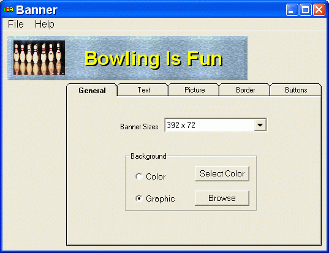



## RebaBanner

### Description

Create buttons and banners for your web site or use in you programs

UPDATE:

Added outlined text
 
### More Info
 

             |
---                |---
**Submitted On**   |2004-11-23 15:35:40
**By**             |[Wayne Spangler](https://github.com/Planet-Source-Code/PSCIndex/blob/master/ByAuthor/wayne-spangler.md)
**Level**          |Intermediate
**User Rating**    |5.0 (20 globes from 4 users)
**Compatibility**  |VB 6\.0
**Category**       |[Graphics](https://github.com/Planet-Source-Code/PSCIndex/blob/master/ByCategory/graphics__1-46.md)
**World**          |[Visual Basic](https://github.com/Planet-Source-Code/PSCIndex/blob/master/ByWorld/visual-basic.md)
**Archive File**   |[RebaBanner18211911232004\.zip](https://github.com/Planet-Source-Code/wayne-spangler-rebabanner__1-57358/archive/master.zip)

### API Declarations

Uses 2 api's - GetPixel & SetPixel

